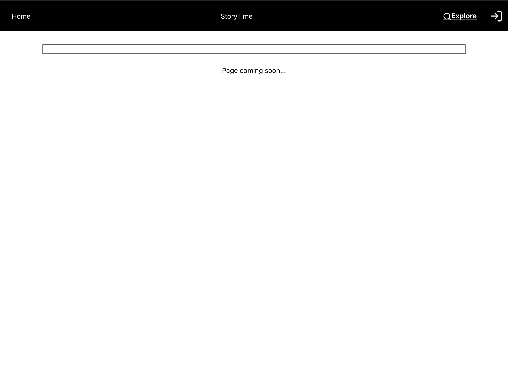

Welcome to Storytime! Storytime is an application I created as my final project at Concordia Bootcamps. This application is a social media platform for writers and other individuals such as journalists or just anyone with an idea to connect. 

Let's begin with when you first get onto the website.

Storytime welcomes you with a neat homepage that describes what you can do... And that's tell stories!

Once you're on the homepage you'll see that you can click on the "home" link which is where we are, the StoryTime link which is the homefeed, an explore link and a log in link. For now, let's see what that log in link looks like. 

You'll notice that when you click the button next to the explore link, you'll be created with a log in button. Upon clicking that, you'll be redirected to auth0 where you can log in with gmail securely, or create an entirely new account. Let's log in with my email for now.

You'll see that once we're logged in we're back at the homepage and my user is logged in! You can click on your user to have a logout button pop up and log out. For now lets stay logged into my user and explore what has been done so far!

Welcome to the main part of the application which I like to call the StoryFeed. I've included a rich text editor which will allow users to write and post a story directly to the application. (There are some bugs and not all the H1 tags etc work in the editor). Users have the option of seeing all the stories from everyone on the website or viewing their own personal feed. You'll see under each post there is an option for future ideas that haven't been added like "reply, add to their story, like their story or share their story". A funny gimmick while working on the project is that when a user posts, they get logged out... Sorry!

Since we're logged into my user right now, if we click on My Feed we'll be able to see all of the stories that I've created. All of the stories and user information is stored into a collection made on MongoDB and can only be accessed by the admin. Considering that this is a very early application, I decided that it would be best to create a feed instead of a user profile. 

The last part of the application that I was able to work on before the deadline was the search page. The idea of this page is that users can find each other or even search for stories instead of having to search through the whole homepage. That isn't currently finished but maybe one day!

This project was largely inspired by my own ambition and imagination. A few years ago while I was majoring in Political Science, I loved writing and the idea of the website Medium. I thought to myself what if I could make my own application? I wanted to have a stand out feature which in my mind would have been being able to add onto their stories, similiar to github. 

Anyways, thank you for taking a look!

Jordan Gabay